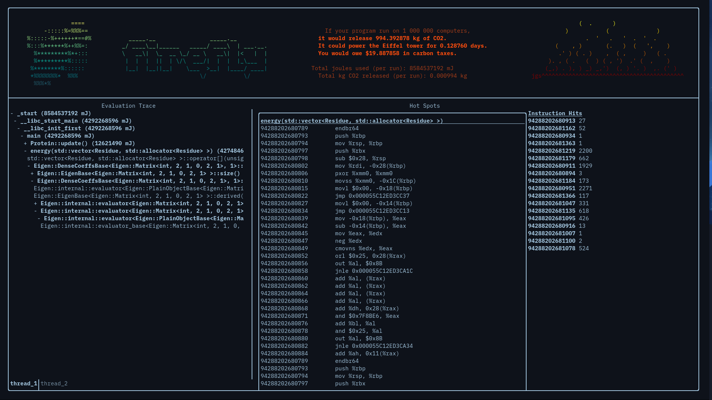

<p align="center"></p>

# firefly


The first-ever climate-conscious profiler! Built for TartanHacks 2024: Amplify.

Firefly samples multiple executions of an executable while recording energy usage through Intel RAPL. Along with displaying the entire stack trace of the program, it displays and disassembles the most energy-consuming functions so that the user can have some insight on how to optimize them to run more efficiently.

To run the Firefly profiler and generate the associated JSON:
```
mkdir build
cmake ..
make
./leaf program
```

To run the GUI on a generated profile (JSON): 
```
cd ui-beta
mkdir build
cmake ..
make
./ftxui-starter profile.json
```
